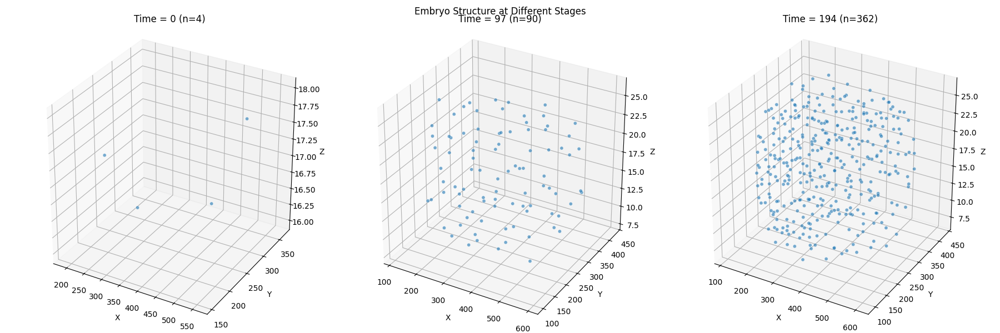
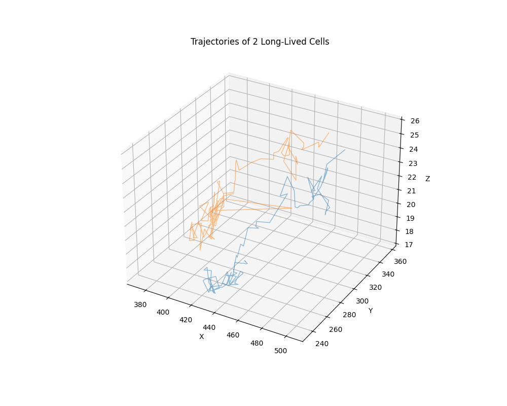

# C. elegans Embryo Analysis Demo

This repository contains tools to analyze and visualize the development of a *C. elegans* embryo using tracking data and raw 3D microscopy images.

## Structure
- **Data/**: Contains raw TIFF images and `tracks.csv`.
- **Scripts/**: Python scripts for analysis and plotting.
- **Plots/**: Generated visualizations.

## Setup
1. Install dependencies:
   ```bash
   pip install numpy pandas matplotlib seaborn scikit-image opencv-python tqdm
   ```

2. Ensure your data is organized:
   - `tracks.csv` in the root or specified path.
   - Raw TIFF files in `Data/Train_Data/Fluo-N3DH-CE/01/` (or update paths in scripts).

## Usage

### 1. General Dataset Plots
Generate cell count, volume distribution, and 3D structure plots:
```bash
python -m Scripts.plot_dataset --input_file tracks.csv
```

### 2. Visualize Raw Data (MIPs)
Generate Maximum Intensity Projections of the raw 3D images:
```bash
python -m Scripts.visualize_raw_tiffs --data_dir Data/Train_Data/Fluo-N3DH-CE/01
```

### 3. Full Analysis & Video Generation
Perform shape analysis, micro-dynamics calculation, behavioral state clustering, and generate a synchronized video:

**Step A: Analyze**
```bash
python -m Scripts.analyze_embryo --input_file tracks.csv
```
*Outputs `embryo_analysis_results.csv`*

**Step B: Create Video**
```bash
python -m Scripts.create_development_video --results embryo_analysis_results.csv --data_dir Data/Train_Data/Fluo-N3DH-CE/01
```
*Outputs `embryo_development.mp4`*

## Demo Output

### 3D Embryo Structure & Trajectories



### Development Animation
Synchronized view of Raw Data, Micro-dynamics, and Behavioral States:


